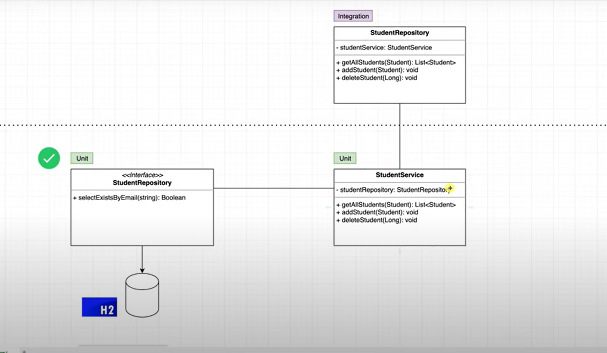

### May 18, 2025
### Learned & Practiced Unit & Integration testing using JUnit 5 by AmigosCode
https://www.youtube.com/watch?v=Geq60OVyBPg
1. Tested basic junit
2. Added Validation Dependency at POM.xml
3. Added Logger Class
`   private static final Logger logger = LoggerFactory.getLogger(StudentService.class);`g
* log.trace("Trace log for method start");
* log.debug("Debugging student object: {}", student);
* log.info("Student added successfully");
* log.warn("Student with duplicate email tried to register");
* log.error("Exception occurred while adding student", ex);

### TESTING IN ISOLATION

### May 19, 2025
4. Added H2 Database
### Unit Testing of Custom student repositories
* added H2 db dependency in POM.XML (left click in pom file > maven > reload project)
* Student Repository generate test for Custom Query selectEmailExist
* Create Resource Folder in Test & add application.properties then configure using H2 db in memory access
* Start unit testing & debugging.
### May 19, 2025
### Unit Testing of Custom student service
### Select the Service Class then Ctrl + Shift + T then generate methods

